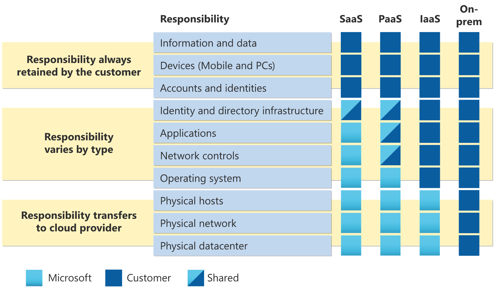

# Cloud Concepts (25–30%)

- [Cloud Concepts (25–30%)](#cloud-concepts-2530)
  - [Cloud Computing](#cloud-computing)
    - [Define cloud computing](#define-cloud-computing)
    - [Describe the shared responsibility model](#describe-the-shared-responsibility-model)
    - [Define the Public Cloud Model](#define-the-public-cloud-model)
    - [Define the Private Cloud Model](#define-the-private-cloud-model)
    - [Define the Hybrid Cloud Model](#define-the-hybrid-cloud-model)
    - [Describe the consumption-based model](#describe-the-consumption-based-model)
    - [Compare cloud pricing models](#compare-cloud-pricing-models)
  - [Benefits of using cloud services](#benefits-of-using-cloud-services)
    - [Describe the benefits of high availability and scalability in the cloud](#describe-the-benefits-of-high-availability-and-scalability-in-the-cloud)
    - [Describe the benefits of reliability and predictability in the cloud](#describe-the-benefits-of-reliability-and-predictability-in-the-cloud)
    - [Describe the benefits of security and governance in the cloud](#describe-the-benefits-of-security-and-governance-in-the-cloud)
    - [Describe the benefits of manageability in the cloud](#describe-the-benefits-of-manageability-in-the-cloud)
  - [Cloud Service Types](#cloud-service-types)
    - [Describe Infrastructure as a Service (IaaS)](#describe-infrastructure-as-a-service-iaas)
    - [Describe Platform as a Service (PaaS)](#describe-platform-as-a-service-paas)
    - [Describe Software as a Service (SaaS)](#describe-software-as-a-service-saas)
    - [Describe Serverless Computing](#describe-serverless-computing)

## Cloud Computing

Terms: https://azure.microsoft.com/en-us/resources/cloud-computing-dictionary/

### Define cloud computing

Simply put, cloud computing is the delivery of computing services—including servers, storage, databases, networking, software, analytics, and intelligence—over the Internet (“the cloud”) to offer faster innovation, flexible resources, and economies of scale. You typically pay only for cloud services you use, helping you lower your operating costs, run your infrastructure more efficiently, and scale as your business needs change. ([Azure documentation](https://azure.microsoft.com/en-us/resources/cloud-computing-dictionary/what-is-cloud-computing/))

Cloud computing is the on-demand availability of computer system resources, especially data storage (cloud storage) and computing power, without direct active management by the user. Cloud computing relies on sharing of resources to achieve coherence and typically uses a "pay as you go" model, which can help in reducing capital expenses but may also lead to unexpected operating expenses for users. ([Wikipedia](https://en.wikipedia.org/wiki/Cloud_computing))

Cloud computing is a model of delivering computing resources (such as servers, storage, databases, networking, software, analytics, intelligence) over the Internet ("the cloud") to offer faster innovation, flexible resources, and economies of scale. Cloud computing providers offer these services on-demand, like electricity from a power grid, and users only pay for what they use. These services can be divided into three main categories: Infrastructure-as-a-Service (IaaS), Platform-as-a-Service (PaaS), and Software-as-a-Service (SaaS). ([ChatGPT](https://chat.openai.com/chat)).

### Describe the shared responsibility model

Link: https://learn.microsoft.com/en-us/azure/security/fundamentals/shared-responsibility

The workload responsibilities vary depending on whether the workload is hosted on Software as a Service (SaaS), Platform as a Service (PaaS), Infrastructure as a Service (IaaS), or in an on-premises datacenter.

Regardless of the type of deployment, the following responsibilities are always retained by you:

- Data
- Endpoints
- Account
- Access management

Reading: <https://azure.microsoft.com/en-us/resources/shared-responsibility-for-cloud-computing/>

### Define the Public Cloud Model

Link: https://azure.microsoft.com/en-us/resources/cloud-computing-dictionary/what-is-a-public-cloud/

Public clouds are owned and operated by a third-party cloud service providers, which deliver their computing resources, like servers and storage, over the Internet. Microsoft Azure is an example of a public cloud. With a public cloud, all hardware, software, and other supporting infrastructure is owned and managed by the cloud provider. You access these services and manage your account using a web browser. They may be free or sold on-demand, allowing customers to pay only per usage for the CPU cycles, storage, or bandwidth they consume.

Unlike private clouds, public clouds can save companies from the expensive costs of having to purchase, manage, and maintain on-premises hardware and application infrastructure - the cloud service provider is held responsible for all management and maintenance of the system. Public clouds can also be deployed faster than on-premises infrastructures and with an almost infinitely scalable platform. Every employee of a company can use the same application from any office or branch using their device of choice as long as they can access the Internet. While security concerns have been raised over public cloud environments, when implemented correctly, the public cloud can be as secure as the most effectively managed private cloud implementation if the provider uses proper security methods, such as intrusion detection and prevention systems (IDPS).

Related products and services:

- Microsoft Azure portal
- App Service

### Define the Private Cloud Model

Link: https://azure.microsoft.com/en-us/resources/cloud-computing-dictionary/what-is-a-private-cloud/

Also called an internal or corporate cloud, a private cloud refers to cloud computing resources used exclusively by a single business or organization. A private cloud can be physically located on the company’s on-site datacenter. Some companies also pay third-party service providers to host their private cloud. A private cloud is one in which the services and infrastructure are maintained on a private network. It gives businesses many of the benefits of a public cloud - including self-service, scalability, and elasticity - with the additional control and customization available from dedicated resources over a computing infrastructure hosted on-premises. In addition, private clouds deliver a higher level of security and privacy through both company firewalls and internal hosting to ensure operations and sensitive data are not accessible to third-party providers. One drawback is that the company’s IT department is held responsible for the cost and accountability of managing the private cloud. So private clouds require the same staffing, management, and maintenance expenses as traditional datacenter ownership.

Two models for cloud services can be delivered in a private cloud. The first is infrastructure as a service (IaaS) that allows a company to use infrastructure resources such as compute, network, and storage as a service. The second is platform as a service (PaaS) that lets a company deliver everything from simple cloud-based applications to sophisticated-enabled enterprise applications. Private clouds can also be combined with public clouds to create a hybrid cloud, allowing the business to take advantage of cloud bursting to free up more space and scale computing services to the public cloud when computing demand increases.

Related products and services:

- Virtual Network
- Azure ExpressRoute

### Define the Hybrid Cloud Model

Link: https://azure.microsoft.com/en-us/resources/cloud-computing-dictionary/what-is-hybrid-cloud-computing/

Hybrid clouds combine public and private clouds, bound together by technology that allows data and applications to be shared between them. By allowing data and applications to move between private and public clouds, a hybrid cloud gives your business greater flexibility, more deployment options, and helps optimize your existing infrastructure, security, and compliance.

No matter which definition of hybrid cloud you use, the benefits are the same: When computing and processing demand increases beyond an on-premises datacenter’s capabilities, businesses can use the cloud to instantly scale capacity up or down to handle excess capacity. It also allows them to avoid the time and cost of purchasing, installing, and maintaining new servers that they may not always need.

Related products and services:

- Azure Arc
- Azure Stack
- Azure Sentinel
- Azure Defender
- Azure ExpressRoute
- Azure VPN Gateway

### Describe the consumption-based model

Link: <https://learn.microsoft.com/en-us/azure/architecture/framework/cost/design-price>

The common pricing options for Azure services are:

1. **Consumption-based price**: You are charged for only what you use. This model is also known as the Pay-As-You-Go rate.
2. **Fixed price**: You provision resources and are charged for those instances whether or not they are used.

### Compare cloud pricing models

TODO

## Benefits of using cloud services

1. Cost
2. Speed
3. Global scale
4. Productivity
5. Performance
6. Reliability
7. Security

### Describe the benefits of high availability and scalability in the cloud

TODO

### Describe the benefits of reliability and predictability in the cloud

TODO

### Describe the benefits of security and governance in the cloud

TODO

### Describe the benefits of manageability in the cloud

TODO

## Cloud Service Types

Most cloud computing services fall into four broad categories:

1. Infrastructure as aService (IaaS)
2. Platform as a Service (PaaS)
3. Serverless
4. Software as a Service (SaaS)

These are sometimes called the cloud computing "stack" because they build on top of one another.  
Knowing what they are and how they’re different makes it easier to accomplish your business goals.

### Describe Infrastructure as a Service (IaaS)

Link: https://azure.microsoft.com/en-us/resources/cloud-computing-dictionary/what-is-iaas/

Summary: servers, storage, network

The most basic category of cloud computing services. With IaaS, you rent IT infrastructure—servers and virtual machines (VMs), storage, networks, operating systems—from a cloud provider on a pay-as-you-go basis.

It helps you reduce maintenance of on-premises data centers, save money on hardware costs, and gain real-time business insights. IaaS solutions give you the flexibility to scale your IT resources up and down with demand. They also help you quickly provision new applications and increase the reliability of your underlying infrastructure.

It lets you bypass the cost and complexity of buying and managing physical servers and datacenter infrastructure. Each resource is offered as a separate service component, and you only pay for a particular resource for as long as you need it. A cloud computing service provider like Azure manages the infrastructure, while you purchase, install, configure, and manage your own software—including operating systems, middleware, and applications.

Advantages:

- Reduces capital expenditures and optimizes costs
- Increases scale and performance of IT workloads
- Increases stability, reliability, and supportability
- Improves business continuity and disaster recovery
- Enhances security
- Helps you innovate and get new apps to users faster

Schenarios:

- Lift-and-shift migration
- Test and development
- Storage, backup, and recovery
- Web apps
- High-performance computing

### Describe Platform as a Service (PaaS)

Link: https://azure.microsoft.com/en-us/resources/cloud-computing-dictionary/what-is-paas/

Platform as a service refers to cloud computing services that supply an on-demand environment for developing, testing, delivering, and managing software applications. PaaS is designed to make it easier for developers to quickly create web or mobile apps, without worrying about setting up or managing the underlying infrastructure of servers, storage, network, and databases needed for development.

Summary: IaaS + OS, middleware, tools and more (designed to support the complete development lifecycle: build, test, deploy, manage, update)

It allows you to avoid the expense and complexity of buying and managing software licenses, the underlying application infrastructure and middleware, container orchestrators such as Kubernetes, or the development tools and other resources. You manage the applications and services you develop, and the cloud service provider typically manages everything else.

Advantages:

- Cut coding time
- Add development capabilities without adding staff
- Develop for multiple platforms—including mobile—more easily
- Use sophisticated tools affordably
- Support geographically distributed development teams
- Efficiently manage the application lifecycle

Scenarios:

- Development framework
- Analytics or business intelligence
- Additional services

### Describe Software as a Service (SaaS)

Link: https://azure.microsoft.com/en-us/resources/cloud-computing-dictionary/what-is-saas/

Software as a service is a method for delivering software applications over the Internet, on demand and typically on a subscription basis. With SaaS, cloud providers host and manage the software application and underlying infrastructure, and handle any maintenance, like software upgrades and security patching. Users connect to the application over the Internet, usually with a web browser on their phone, tablet, or PC.

Summary: PaaS + Software

Common examples: emails, calendaring, office tools (Office 365)

SaaS provides a complete software solution that you purchase on a pay-as-you-go basis from a cloud service provider. You rent the use of an app for your organization, and your users connect to it over the Internet, usually with a web browser. All of the underlying infrastructure, middleware, app software, and app data are located in the service provider’s data center. The service provider manages the hardware and software, and with the appropriate service agreement, will ensure the availability and the security of the app and your data as well. SaaS allows your organization to get quickly up and running with an app at minimal upfront cost.

Advantages:

- Gain access to sophisticated applications
- Pay only for what you use
- Use free client software
- Mobilize your workforce easily
- Access app data from anywhere

### Describe Serverless Computing

Link: https://azure.microsoft.com/en-us/resources/cloud-computing-dictionary/what-is-serverless-computing/

Serverless computing enables developers to build applications faster by eliminating the need for them to manage infrastructure. With serverless applications, the cloud service provider automatically provisions, scales, and manages the infrastructure required to run the code.

In understanding the definition of serverless computing, it’s important to note that servers are still running the code. The serverless name comes from the fact that the tasks associated with infrastructure provisioning and management are invisible to the developer. This approach enables developers to increase their focus on the business logic and deliver more value to the core of the business. Serverless computing helps teams increase their productivity and bring products to market faster, and it allows organizations to better optimize resources and stay focused on innovation.

Benefits:

- No Infrastructure management
- Dynamic Scalability
- Faster time to market
- More efficient use of resources

Patterns:

- Serverless functions
- Serverless Kubernetes
- Serverless Workflows
- Serverless application Environments
- Serverless API gateway
